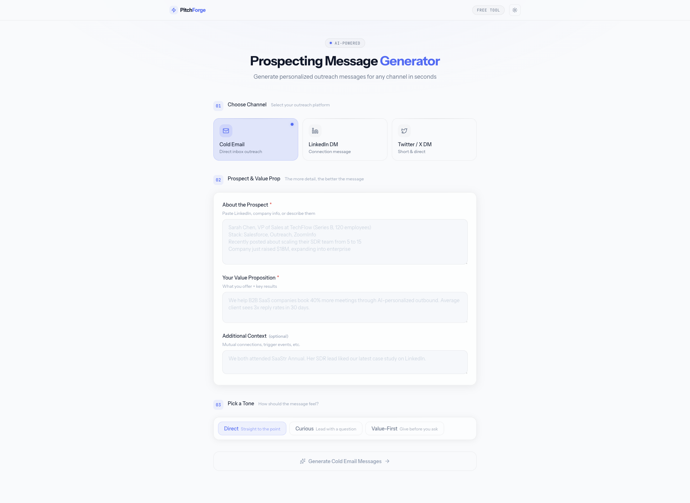

# PitchForge - AI Prospecting Message Generator

### [Live Demo](https://prospecting-generator.vercel.app/)



Free AI-powered tool that generates personalized cold emails, LinkedIn DMs, and Twitter/X messages for B2B prospecting. Paste prospect info, pick a channel and tone, and get 3 strategic message variations with reasoning in seconds.

## Stack

- Next.js 16 (App Router) + TypeScript
- Tailwind CSS v4 with glass morphism design system
- Groq API (Llama 3.3 70B) for message generation
- Light/dark theme, Lucide icons, PostHog analytics

## Getting Started

```bash
npm install
```

Add your Groq API key to `.env.local`:

```
GROQ_API_KEY=gsk_your_key_here
```

```bash
npm run dev
```

Open [http://localhost:3000](http://localhost:3000).
